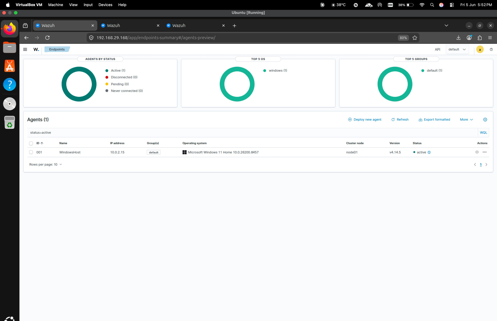
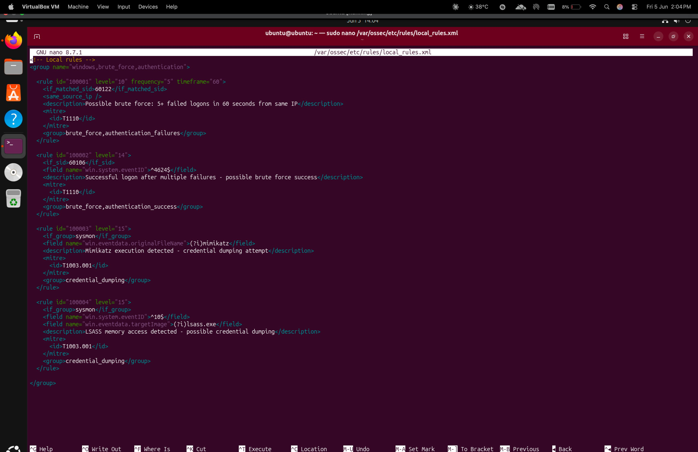
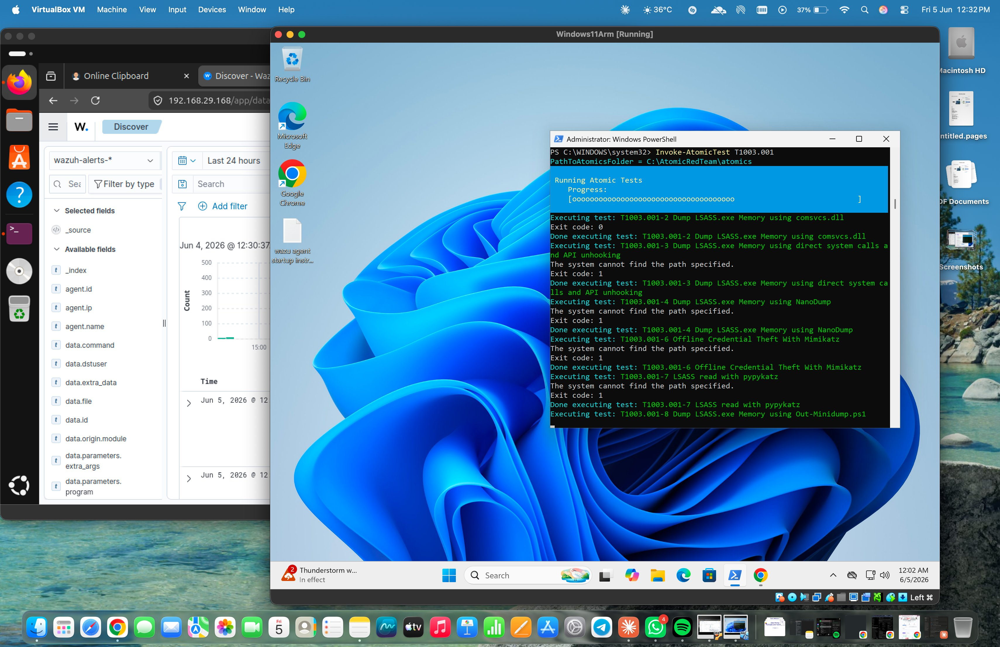
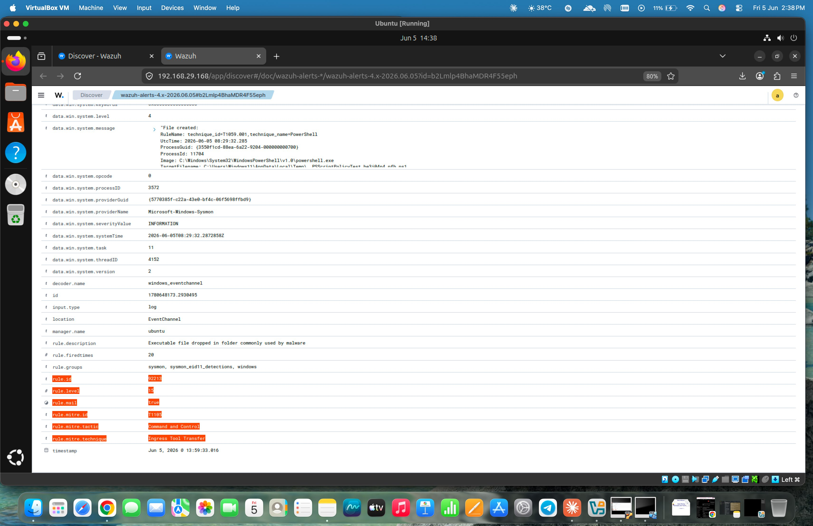
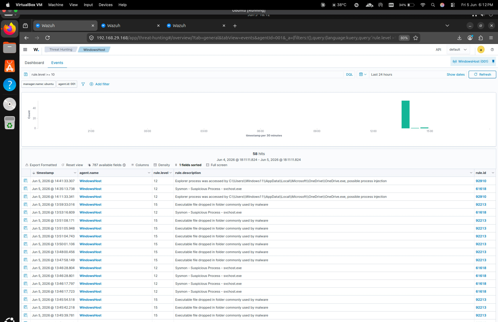
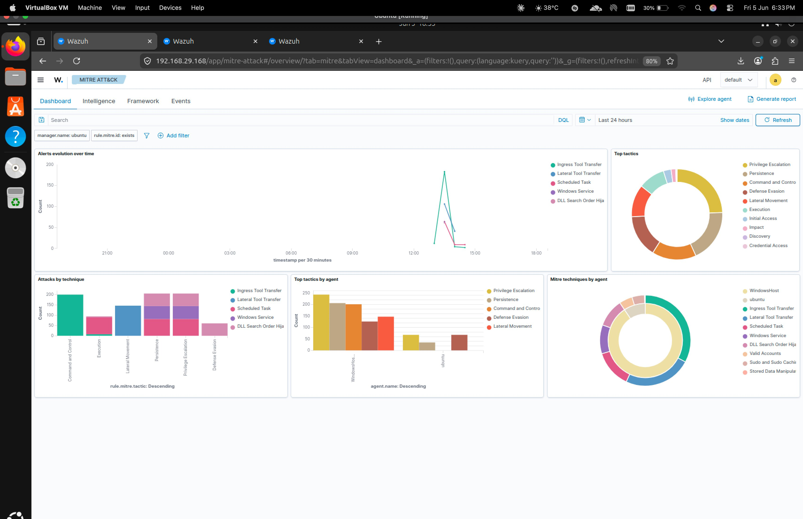
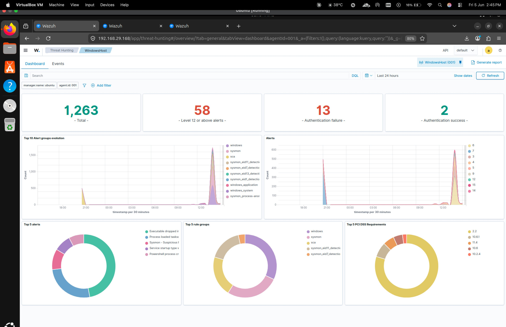

# SOC Analyst Home Lab — Brute Force Attack Detection with Wazuh SIEM


---

## Project Overview

A fully functional SOC home lab built to simulate, detect, and document a real-world brute force attack scenario. This project covers the complete SOC analyst workflow — from deploying a SIEM and configuring endpoint telemetry, to writing custom detection rules, simulating attacks using industry-standard red team tooling, triaging alerts, and producing a formal Incident Response report.

The lab demonstrates hands-on competency with tools and workflows used daily in enterprise SOC environments.

---

## Lab Architecture

```
┌─────────────────────────────┐         ┌──────────────────────────────┐
│      Windows 11 ARM VM      │         │       Ubuntu Server VM       │
│      (WindowsHost)          │────────▶│       (Wazuh Manager)        │
│                             │  TCP    │                              │
│  • Wazuh Agent v4.14.5      │  1514   │  • Wazuh Manager 4.14.5      │
│  • Sysmon (Deep Telemetry)  │         │  • Wazuh Dashboard           │
│  • Atomic Red Team          │         │  • OpenSearch                │
│  • PowerShell (Attacker)    │         │  • Custom Detection Rules    │
│                             │         │                              │
│  IP: 10.0.2.15              │         │  IP: 192.168.29.168          │
└─────────────────────────────┘         └──────────────────────────────┘
```

---

## Tools & Technologies

| Tool | Version | Purpose |
|------|---------|---------|
| Wazuh | 4.14.5 | SIEM — log ingestion, correlation, alerting |
| Sysmon | Latest | Deep Windows endpoint telemetry |
| Atomic Red Team | Latest | MITRE ATT&CK-mapped attack simulation |
| Windows 11 ARM | 10.0.26200 | Target endpoint |
| Ubuntu Server | Latest LTS | Wazuh manager and dashboard host |
| OpenSearch | Bundled | Log storage and visualization |
| VirtualBox | Latest | Hypervisor for both VMs |

---

## Attacks Simulated

| Technique ID | Technique Name | Tool Used | Target |
|---|---|---|---|
| T1110.001 | Brute Force: Password Guessing | Atomic Red Team | Local Windows Auth |
| T1110.003 | Brute Force: Password Spraying | Atomic Red Team | Local Windows Auth |
| T1003.001 | OS Credential Dumping: LSASS Memory | Atomic Red Team | LSASS Process |

---

## Detections Achieved

| Rule ID | Description | Severity | MITRE Technique | Data Source |
|---------|-------------|----------|-----------------|-------------|
| 92213 | Executable file dropped in folder commonly used by malware | **Level 15 — Critical** | T1105 — Ingress Tool Transfer | Sysmon EID 11 |
| 92910 | Explorer process injection detected | **Level 12 — High** | T1055 — Process Injection | Sysmon |
| 61618 | Sysmon — Suspicious process: svchost.exe | **Level 12 — High** | T1055 — Process Injection | Sysmon |
| 100001 | 5+ failed logons in 60 seconds (custom rule) | **Level 10 — High** | T1110 — Brute Force | Security EID 4625 |

> **Total alerts generated:** 1,263 events — 58 at Level 12 or above — 13 authentication failures — 2 authentication successes

---

## Screenshots

### 1. Windows Agent Active in Wazuh Dashboard
Agent `WindowsHost` (ID: 001) connected and reporting from IP `10.0.2.15` running Windows 11 Home.



---

### 2. Custom Detection Rules Loaded
Four custom Wazuh correlation rules written in XML covering brute force, credential dumping, and LSASS access detection.



---

### 3. Atomic Red Team Attack Execution
`Invoke-AtomicTest T1003.001` executing on Windows 11 — simulating LSASS credential dumping with multiple sub-techniques running simultaneously.



---

### 4. Level 15 Critical Alert — Attack Tool Detected
Rule 92213 fired at maximum severity (Level 15). Sysmon EID 11 detected PowerShell dropping a `.ps1` script into the Temp directory — a known attacker staging behaviour. MITRE T1105 (Ingress Tool Transfer) automatically mapped. Alert fired 20 times during the session.



---

### 5. Alert List — Threat Hunting View
58 alerts at Level 12 or above captured during the attack session. Multiple rule IDs firing including 92213 (Level 15), 92910 and 61618 (Level 12). Attack spike clearly visible in the timeline at 13:00–15:00.



---

### 6. MITRE ATT&CK Dashboard
Multiple MITRE tactics detected and mapped automatically: Command and Control (T1105), Execution, Lateral Movement, Persistence, Privilege Escalation, Defense Evasion. Ingress Tool Transfer was the dominant technique by count.



---

### 7. Threat Hunting Dashboard — Attack Timeline
1,263 total events captured. Clear spike in Sysmon and Windows alert groups during attack execution. Top 5 alerts dominated by "Executable file dropped in malware folder" confirming successful detection of Atomic Red Team tooling.



---

## Custom Rules Written

Four custom Wazuh correlation rules were engineered from scratch. Full file: [`detection-rules/local_rules.xml`](detection-rules/local_rules.xml)

| Rule ID | Logic | Level | MITRE |
|---------|-------|-------|-------|
| 100001 | 5+ failed logons from same IP within 60 seconds | 10 | T1110 |
| 100002 | Successful logon following multiple failures | 14 | T1110 |
| 100003 | Mimikatz original filename detected via Sysmon | 15 | T1003.001 |
| 100004 | LSASS memory access via Sysmon Event ID 10 | 15 | T1003.001 |

Full line-by-line explanation: [`detection-rules/rule-explanation.md`](detection-rules/rule-explanation.md)

---

## Project Structure

```
SOC-Analyst-Home-Lab/
├── README.md
├── lab-setup/
│   ├── architecture.md          # Lab setup and configuration steps
│   └── sysmon-setup.md          # Sysmon deployment guide
├── detection-rules/
│   ├── local_rules.xml          # 4 custom Wazuh detection rules
│   └── rule-explanation.md      # Line-by-line rule breakdown
├── attack-simulation/
│   └── attack-commands.md       # Exact commands run during simulation
├── evidence/
│   ├── alert_T1105.json         # Raw alert JSON — Level 15 detection
│   └── screenshots/             # All 7 lab screenshots
└── incident-report/
    └── IR-001-BruteForce.md     # Formal incident response report
```

---

## Key SOC Skills Demonstrated

- **SIEM Deployment** — End-to-end Wazuh installation and configuration on Ubuntu
- **Endpoint Telemetry** — Sysmon deployment for deep Windows event visibility
- **Custom Rule Engineering** — XML-based Wazuh correlation rules with frequency/timeframe logic
- **MITRE ATT&CK Mapping** — Techniques tagged and visible in the ATT&CK dashboard
- **Threat Simulation** — Atomic Red Team execution of real ATT&CK techniques
- **Alert Triage** — Investigation of multi-source alerts across Security and Sysmon channels
- **Log Analysis** — Direct analysis of raw JSON alert logs and archives
- **Incident Response** — Formal IR report with attack timeline, IOCs, and recommendations
- **Troubleshooting** — Diagnosed and resolved XML rule errors, log collection gaps, rule chain mismatches

---

## Incident Report

A formal Incident Response report was produced following the attack simulation.

[View IR-001 — Brute Force Detection Report](incident-report/IR-001-BruteForce.md)

---

## Author

**Rahul Yadav**  
SOC Analyst | Blue Team | Threat Detection  
[GitHub](https://github.com/rahulllyadavvv)
